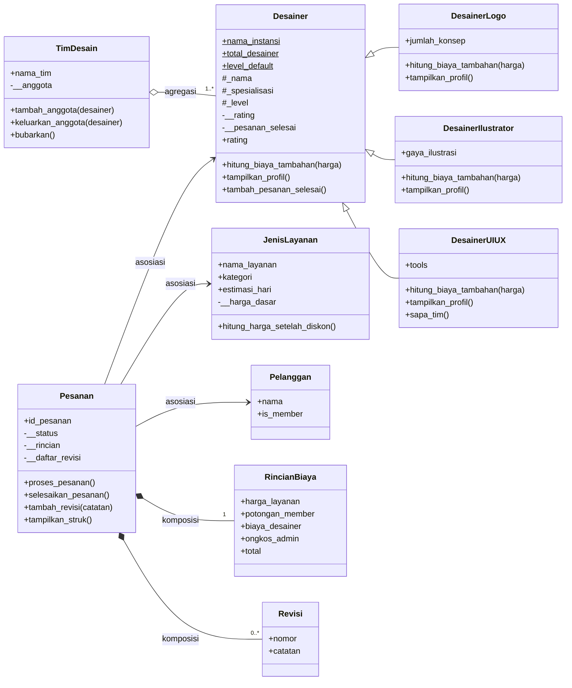

# Sistem Manajemen Pesanan Desain Grafis — Desaignkan_id

Program Python berbasis **Object-Oriented Programming (OOP)** untuk mengelola pesanan
jasa desain grafis pada usaha kreatif fiktif **Desaignkan_id**, berdasarkan jenis layanan
(logo, banner, UI/UX, dll).

Materi yang diterapkan:
- Modul 1 — Class & Object
- Modul 2 — Atribut (instance & kelas) dan Method (instance, class, static)
- Modul 3 — Encapsulation (public, protected, private) & Property (getter/setter)
- Modul 4 — **Relasi UML** (Asosiasi, Agregasi, Komposisi) dan **Inheritance**

---

## 1. Diagram UML



---

## 2. Struktur Class

Program terdiri dari 10 class. Class lama (`JenisLayanan`, `Desainer`, `Pesanan`) tetap
dipertahankan dan dikembangkan, lalu ditambah class baru untuk relasi UML dan inheritance.

| Class | Peran |
|---|---|
| `JenisLayanan` | Jenis layanan desain yang dijual |
| `Desainer` | **Superclass** desainer |
| `DesainerLogo`, `DesainerIlustrator`, `DesainerUIUX` | **Subclass** dari `Desainer` |
| `Pelanggan` | Data pelanggan (baru) |
| `TimDesain` | Kumpulan desainer, contoh **agregasi** (baru) |
| `Pesanan` | Transaksi pesanan, contoh **asosiasi** & **komposisi** |
| `RincianBiaya`, `Revisi` | Bagian dari `Pesanan`, contoh **komposisi** (baru) |

---

## 3. Penerapan Relasi UML

### a. Asosiasi (Association)
Hubungan antar objek yang **saling independen**. Objek dibuat di luar, lalu hanya
direferensikan.

- `Pesanan` → `Pelanggan`
- `Pesanan` → `JenisLayanan`
- `Pesanan` → `Desainer`

```python
pesanan_1 = Pesanan("ORD001", yusuf, layanan_logo, desainer_dea)
```
Jika `Pesanan` dihapus (`del pesanan_3`), objek `Pelanggan`, `JenisLayanan`, dan `Desainer`
**tetap ada**.

### b. Agregasi (Aggregation) — "has-a" lemah
`TimDesain` **memiliki** banyak `Desainer`, tetapi `Desainer` dibuat di luar tim dan
diberikan lewat `tambah_anggota()`.

```python
tim = TimDesain("Tim Kreatif Alpha")
tim.tambah_anggota(desainer_dea)   # objek dibuat di luar TimDesain
tim.bubarkan()                     # tim bubar, desainer_dea TETAP hidup
```

### c. Komposisi (Composition) — "has-a" kuat
`Pesanan` **memiliki** `RincianBiaya` dan daftar `Revisi`. Kedua objek tersebut **dibuat
di dalam** `Pesanan` (di `__init__` dan `tambah_revisi()`), tidak dibuat dari luar, dan
tidak punya arti tanpa `Pesanan`. Jika `Pesanan` dihapus, bagian-bagiannya ikut hilang.

```python
self.__rincian = RincianBiaya()            # dibuat di dalam constructor Pesanan
revisi = Revisi(nomor, catatan)            # dibuat di dalam method tambah_revisi()
```

| Relasi | Contoh | Dibuat oleh | Jika "whole" dihapus |
|---|---|---|---|
| Asosiasi | `Pesanan` → `Pelanggan` | Di luar class | Objek lain tetap ada |
| Agregasi | `TimDesain` o-- `Desainer` | Di luar class | Anggota tetap ada |
| Komposisi | `Pesanan` *-- `RincianBiaya`, `Revisi` | Di dalam class | Bagian ikut hilang |

---

## 4. Penerapan Inheritance

### a. Superclass & Subclass
- **Superclass:** `Desainer`
- **Subclass:** `DesainerLogo`, `DesainerIlustrator`, `DesainerUIUX`

### b. Penggunaan `super()`
Setiap subclass memanggil konstruktor superclass:

```python
class DesainerLogo(Desainer):
    def __init__(self, nama, rating_awal=5.0, jumlah_konsep=3):
        super().__init__(nama, "Logo & Branding", rating_awal)
        self.jumlah_konsep = jumlah_konsep
```

### c. Atribut Tambahan (unik per subclass)

| Subclass | Atribut unik |
|---|---|
| `DesainerLogo` | `jumlah_konsep` |
| `DesainerIlustrator` | `gaya_ilustrasi` |
| `DesainerUIUX` | `tools` |

### d. Method Overriding
Method `hitung_biaya_tambahan()` dan `tampilkan_profil()` milik `Desainer` di-override
dengan logika berbeda di setiap subclass:

| Class | `hitung_biaya_tambahan()` |
|---|---|
| `Desainer` | Rp0 (default) |
| `DesainerLogo` | Rp25.000 untuk setiap konsep di atas 3 |
| `DesainerIlustrator` | 10% dari harga layanan (biaya kompleksitas) |
| `DesainerUIUX` | Rp50.000 flat (prototype interaktif) |

`tampilkan_profil()` di subclass memanggil `super().tampilkan_profil()` lalu menambahkan
informasi atribut uniknya. Method `Pesanan.proses_pesanan()` memanggil
`self.desainer.hitung_biaya_tambahan()` tanpa peduli tipe subclass-nya (**polymorphism**).

### e. Tingkat Akses pada Pewarisan

| Akses | Atribut di `Desainer` | Keterangan |
|---|---|---|
| Protected `_` | `_nama`, `_spesialisasi`, `_level` | Dipakai langsung oleh subclass, contoh di `DesainerUIUX.sapa_tim()` |
| Private `__` | `__rating`, `__pesanan_selesai` | Rahasia superclass; subclass/luar harus lewat property `rating`, `pesanan_selesai`, atau method `tambah_pesanan_selesai()` |

---

## 5. Konsep Encapsulation (dari Modul 3)

- Public — misal `nama_layanan`, `id_pesanan`, `jumlah_konsep`.
- Protected — `_nama`, `_spesialisasi`, `_level` pada `Desainer`.
- Private — `__harga_dasar`, `__rating`, `__status`, `__rincian`, `__daftar_revisi`,
  `__anggota`, dilindungi *name mangling* dan hanya diubah lewat property/method.
- Setiap setter punya validasi (harga > 0, rating 0–5, status harus ada di `status_valid`).
  Data tidak valid ditolak dengan pesan `[GAGAL]` tanpa menghentikan program.

---

## 6. Cara Menjalankan Program

Pastikan Python 3 sudah terpasang, lalu jalankan dari terminal:

```bash
python3 main.py
```

Tidak ada dependency eksternal, program hanya memakai Python standar.

---

## 7. Panduan Pengujian (Main Code)

Bagian `if __name__ == "__main__":` di `main.py` menjalankan demo berikut secara urut:

1. **JenisLayanan** — membuat 3 layanan (konstruktor & factory `dari_dict()`), memanggil
   static method `validasi_kategori()` dan class method `ubah_diskon_member(0.15)`.
2. **Inheritance** — membuat `DesainerLogo`, `DesainerIlustrator` (lewat factory yang
   di-override), dan `DesainerUIUX`. Menampilkan hasil overriding
   `tampilkan_profil()` dan `hitung_biaya_tambahan()`, pengaksesan atribut protected
   (`sapa_tim()`), percobaan akses atribut private (ditolak `AttributeError`), serta
   `isinstance()` / `issubclass()`.
3. **Agregasi** — membuat `TimDesain`, menambah anggota (termasuk uji duplikat dan tipe
   salah), mengeluarkan anggota, lalu `bubarkan()`. Desainer terbukti masih ada.
4. **Asosiasi** — membuat 3 `Pelanggan` dan 3 `Pesanan` yang merujuk ke
   `Pelanggan`, `JenisLayanan`, dan `Desainer`.
5. **Komposisi** — menambah revisi, memproses & menyelesaikan pesanan, menampilkan struk
   dengan `RincianBiaya`, lalu uji revisi ditolak setelah pesanan selesai. Setelah
   `del pesanan_3`, pelanggan dan desainer tetap ada.
6. **Getter & Setter** — menguji `harga_dasar`, `rating`, dan `status` dengan input valid
   (`[OK]`) dan tidak valid (`[GAGAL]`, nilai lama dipertahankan).
7. **Reset statistik** — class method `reset_total_pesanan()`.

Contoh hasil perhitungan yang bisa dicek manual (diskon member 15%, ongkos admin Rp5.000):

| Pesanan | Perhitungan | Total |
|---|---|---|
| ORD001 (member, logo, 5 konsep) | 250.000 − 37.500 + 50.000 + 5.000 | Rp267.500 |
| ORD002 (non-member, banner, ilustrator) | 150.000 − 0 + 15.000 + 5.000 | Rp170.000 |
| ORD003 (member, UI/UX) | 500.000 − 75.000 + 50.000 + 5.000 | Rp480.000 |

---

## 8. Struktur File

```
.
├── main.py       # Seluruh kode program (class + demo pengujian)
└── README.md     # Dokumentasi ini
```